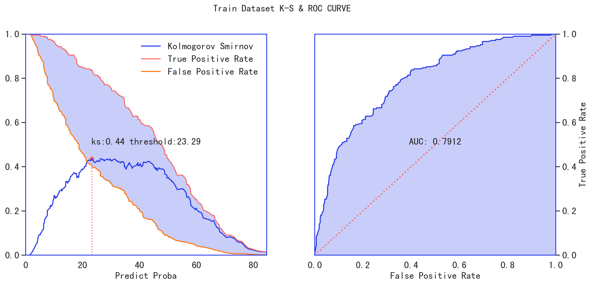

# 可用于 `超参数搜索` & `pipeline` 的逻辑回归

## 概述

分别基于 `statsmodels` 和 `scikit-learn` 实现两种可用于 `sklearn pipeline` 的 `LogisticRegression`，并输出相应的报告，效果如下：

> 基于 `statsmodels` 的 `StatsLogisticRegression`


</img>
</img>


> 基于 `sklearn` 的 `ITLubberLogisticRegression`


</img>

</img>


## 使用方法

```python
target = "creditability"
data = sc.germancredit()
data[target] = data[target].map({"good": 0, "bad": 1})

train, test = train_test_split(data, test_size=0.3, shuffle=True, stratify=data[target])
feature_pipeline = Pipeline([
    ("preprocessing_select", FeatureSelection(target=target, engine="scorecardpy")),
    ("combiner", Combiner(target=target, min_samples=0.2)),
    ("transform", WOETransformer(target=target)),
    ("processing_select", FeatureSelection(target=target, engine="scorecardpy")),
    ("stepwise", StepwiseSelection(target=target)),
])

feature_pipeline.fit(train)

woe_train = feature_pipeline.transform(train)
woe_test = feature_pipeline.transform(test)

# logistic = StatsLogisticRegression(target=target)
logistic = ITLubberLogisticRegression(target=target)

logistic.fit(woe_train)

y_pred_train = logistic.predict(woe_train.drop(columns=target))
y_pred_test = logistic.predict(woe_test.drop(columns=target))

# params_grid = {
#     # "logistic__C": [i / 1. for i in range(1, 10, 2)],
#     # "logistic__penalty": ["l2"],
#     # "logistic__class_weight": [None, "balanced"], # + [{1: i / 10.0, 0: 1 - i / 10.0} for i in range(1, 10)],
#     # "logistic__max_iter": [100],
#     # "logistic__solver": ["sag"] # ["liblinear", "sag", "lbfgs", "newton-cg"],
#     "logistic__intercept": [True, False],
# }

# clf = GridSearchCV(feature_pipeline, params_grid, cv=5, scoring='roc_auc', verbose=-1, n_jobs=2, return_train_score=True)
# clf.fit(train, train[target])

# y_pred_train = clf.best_estimator_.predict(train)
# y_pred_test = clf.best_estimator_.predict(test)

# print(clf.best_params_)

# model summary
# logistic.summary_save()
print(logistic.summary())

print("train: ", toad.metrics.KS(y_pred_train, train[target]), toad.metrics.AUC(y_pred_train, train[target]))
print("test: ", toad.metrics.KS(y_pred_test, test[target]), toad.metrics.AUC(y_pred_test, test[target]))

card = ScoreCard(target=target, pipeline=feature_pipeline, pretrain_lr=logistic)
card.fit(woe_train)

train["score"] = card.predict(train)
test["score"] = card.predict(test)

print(card.feature_bin_stats(train, "score", target=target, rules=[i for i in range(400, 800, 50)], verbose=0, method="step"))
print(card.feature_bin_stats(train, "score", target=target, verbose=0, method="cart"))

train_score_rank = card.feature_bin_stats(train, "score", target=target, rules=[i for i in range(400, 800, 50)], verbose=0, method="step")
test_score_rank = card.feature_bin_stats(test, "score", target=target, rules=[i for i in range(400, 800, 50)], verbose=0, method="step")

writer = pd.ExcelWriter("评分卡结果验证表.xlsx", engine="openpyxl")

train_score_rank.to_excel(writer, sheet_name="训练集评分卡排序性")
test_score_rank.to_excel(writer, sheet_name="测试集评分卡排序性")

writer.close()
```


## 参考

> https://github.com/ing-bank/skorecard/blob/main/skorecard/linear_model/linear_model.py
> 
> https://github.com/itlubber/openpyxl-excel-style-template/blob/main/pipeline_model.py
> 